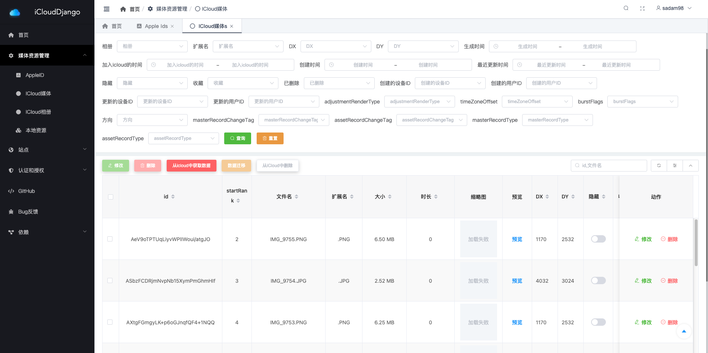

# iCloudDjango

是一个DjangoApp, 在任何一个Django项目中导入便可使用.



### 相关项目

* 🚀 [iCloudSDK](https://github.com/Haoke98/iCloudSDK) 是一个基于Python的icloud通用API调用SDK依赖库.任何一个python项目导入便可使用.
* ☘️ [iCloudDesktop](https://github.com/Haoke98/iCloudDesktop) 是一个跨平台的桌面程序

### 开发计划

* [ ] Deploy to the [PyPI](pypi.org) as a python site-packages.
* [ ] 引入celery并把同步任务交给celery执行,提高其稳定性.

### 使用方法

```shell
pip install django-icloud
```
##### 启动Worker
直接Console启动:
```shell
celery -A proj worker -l INFO
```
后台启动:
```shell
celery -A proj multi start worker1
```
### 引用& 鸣谢

* thanks to [picklepete](https://github.com/picklepete) for [pyicloud](https://github.com/picklepete/pyicloud)
